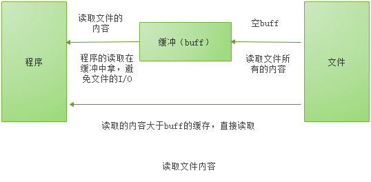

<!-- START doctoc generated TOC please keep comment here to allow auto update -->
<!-- DON'T EDIT THIS SECTION, INSTEAD RE-RUN doctoc TO UPDATE -->


- [bufio](#bufio)
  - [前言](#%E5%89%8D%E8%A8%80)
  - [例子](#%E4%BE%8B%E5%AD%90)
  - [bufio](#bufio-1)
    - [源码解析](#%E6%BA%90%E7%A0%81%E8%A7%A3%E6%9E%90)
    - [Reader对象](#reader%E5%AF%B9%E8%B1%A1)
      - [实例化](#%E5%AE%9E%E4%BE%8B%E5%8C%96)
      - [ReadSlice](#readslice)
      - [ReadString](#readstring)
      - [ReadLine](#readline)
      - [Peek](#peek)
    - [Scanner](#scanner)
      - [Give me more data](#give-me-more-data)
      - [Error](#error)
    - [Writer 对象](#writer-%E5%AF%B9%E8%B1%A1)
      - [实例化](#%E5%AE%9E%E4%BE%8B%E5%8C%96-1)
      - [Available](#available)
      - [Buffered](#buffered)
      - [Flush](#flush)
      - [写入的方法](#%E5%86%99%E5%85%A5%E7%9A%84%E6%96%B9%E6%B3%95)
      - [ReadWriter](#readwriter)
  - [总结](#%E6%80%BB%E7%BB%93)

<!-- END doctoc generated TOC please keep comment here to allow auto update -->

## bufio

### 前言

最近操作文件，进行优化使用到了`bufio`。好像也不太了解这个，那么就梳理下，`bufio`的使用。

### 例子

我的场景：使用`xml`拼接了`office2003`的文档。写入到`buffer`，然后处理完了，转存到文件里面。

````go
type Buff struct {
	Buffer *bytes.Buffer
	Writer *bufio.Writer
}

// 初始化
func NewBuff() *Buff {
	b := bytes.NewBuffer([]byte{})
	return &Buff{
		Buffer: b,
		Writer: bufio.NewWriter(b),
	}
}

func (b *Buff) WriteString(str string) error {
	_, err := b.Writer.WriteString(str)
	return err
}

func (b *Buff) SaveAS(name string) error {
	file, err := os.OpenFile(name, os.O_WRONLY|os.O_TRUNC|os.O_CREATE, 0666)
	if err != nil {
		return err
	}
	defer file.Close()

	if err := b.Writer.Flush(); err != nil {
		return nil
	}

	_, err = b.Buffer.WriteTo(file)
	return err
}

func main() {
	var b = NewBuff()

	b.WriteString("haah")
}
````

### bufio

> Package bufio implements buffered I/O. It wraps an io.Reader or io.Writer object, creating another object (Reader or Writer) that also implements the interface but provides buffering and some help for textual I/O.  

`bufio`包实现了有缓冲的`I/O`。它包装一个`io.Reader`或`io.Writer`接口对象，创建另一个也实现了该接口，且同时还提供了缓冲和一些文本`I/O`的帮助函数的对象。  

简单的说就是`bufio`会把文件内容读取到缓存中（内存），然后再取读取需要的内容的时候，直接在缓存中读取，避免文件的`i/o`操作。同样，通过`bufio`写入内容，也是先写入到缓存中（内存），然后由缓存写入到文件。避免多次小内容的写入操作`I/O`。  

#### 源码解析

#### Reader对象

bufio.Reader 是bufio中对io.Reader 的封装

````go
// Reader implements buffering for an io.Reader object.
type Reader struct {
	buf          []byte 
	rd           io.Reader // 底层的io.Reader
	r, w         int       // r:从buf中读走的字节（偏移）；w:buf中填充内容的偏移； 
	                       // w - r 是buf中可被读的长度（缓存数据的大小），也是Buffered()方法的返回值
	err          error
	lastByte     int // 最后一次读到的字节（ReadByte/UnreadByte)
	lastRuneSize int // 最后一次读到的Rune的大小(ReadRune/UnreadRune)
}
````

bufio.Read(p []byte) 的思路如下：  

1、当缓存区有内容的时，将缓存区内容全部填入p并清空缓存区  
2、当缓存区没有内容的时候且len(p)>len(buf),即要读取的内容比缓存区还要大，直接去文件读取即可  
3、当缓存区没有内容的时候且len(p)<len(buf),即要读取的内容比缓存区小，缓存区从文件读取内容充满缓存区，并将p填满（此时缓存区有剩余内容）  
4、以后再次读取时缓存区有内容，将缓存区内容全部填入p并清空缓存区（此时和情况1一样）  

  

````go
// Read reads data into p.
// It returns the number of bytes read into p.
// The bytes are taken from at most one Read on the underlying Reader,
// hence n may be less than len(p).
// To read exactly len(p) bytes, use io.ReadFull(b, p).
// At EOF, the count will be zero and err will be io.EOF.
func (b *Reader) Read(p []byte) (n int, err error) {
	n = len(p)
	if n == 0 {
		if b.Buffered() > 0 {
			return 0, nil
		}
		return 0, b.readErr()
	}
	// r:从buf中读走的字节（偏移）；w:buf中填充内容的偏移；
	// w - r 是buf中可被读的长度（缓存数据的大小），也是Buffered()方法的返回值
	// b.r == b.w 表示，当前缓冲区里面没有内容
	if b.r == b.w {
		if b.err != nil {
			return 0, b.readErr()
		}
		// 如果p的大小大于等于缓冲区大小，则直接将数据读入p，然后返回
		if len(p) >= len(b.buf) {
			// Large read, empty buffer.
			// Read directly into p to avoid copy.
			n, b.err = b.rd.Read(p)
			if n < 0 {
				panic(errNegativeRead)
			}
			if n > 0 {
				b.lastByte = int(p[n-1])
				b.lastRuneSize = -1
			}
			return n, b.readErr()
		}
		// buff容量大于p，直接将buff中填满
		// One read.
		// Do not use b.fill, which will loop.
		b.r = 0
		b.w = 0
		n, b.err = b.rd.Read(b.buf)
		if n < 0 {
			panic(errNegativeRead)
		}
		if n == 0 {
			return 0, b.readErr()
		}
		b.w += n
	}

	// copy缓存区的内容到p中（填充满p）
	// copy as much as we can
	n = copy(p, b.buf[b.r:b.w])
	b.r += n
	b.lastByte = int(b.buf[b.r-1])
	b.lastRuneSize = -1
	return n, nil
}
````

##### 实例化

`bufio` 包提供了两个实例化 `bufio.Reader` 对象的函数：`NewReader` 和 `NewReaderSize`。其中，`NewReader` 函数是调用 `NewReaderSize`。  
函数实现的：  

````
// NewReader returns a new Reader whose buffer has the default size.
func NewReader(rd io.Reader) *Reader {
    // defaultBufSize = 4096,默认的大小
	return NewReaderSize(rd, defaultBufSize)
}
````

调用的`NewReaderSize`

````go
// NewReaderSize returns a new Reader whose buffer has at least the specified
// size. If the argument io.Reader is already a Reader with large enough
// size, it returns the underlying Reader.
func NewReaderSize(rd io.Reader, size int) *Reader {
	// Is it already a Reader?
	b, ok := rd.(*Reader)
	if ok && len(b.buf) >= size {
		return b
	}
	if size < minReadBufferSize {
		size = minReadBufferSize
	}
	r := new(Reader)
	r.reset(make([]byte, size), rd)
	return r
}
````

##### ReadSlice


// ReadSlice reads until the first occurrence of delim in the input,  
// returning a slice pointing at the bytes in the buffer.  
// The bytes stop being valid at the next read.  
// If ReadSlice encounters an error before finding a delimiter,  
// it returns all the data in the buffer and the error itself (often io.EOF).  
// ReadSlice fails with error ErrBufferFull if the buffer fills without a delim.  
// Because the data returned from ReadSlice will be overwritten  
// by the next I/O operation, most clients should use  
// ReadBytes or ReadString instead.  
// ReadSlice returns err != nil if and only if line does not end in delim.  

`ReadSlice`需要放置一个界定符号，来分割

````go
	reader := bufio.NewReader(strings.NewReader("hello \n world"))
	line, _ := reader.ReadSlice('\n')
	fmt.Printf("the line:%s\n", line)

	line, _ = reader.ReadSlice('\n')
	fmt.Printf("the line:%s\n", line)
````

输出

````
the line:hello 

the line: world
````

`ReadSlice` 从输入中读取，直到遇到第一个界定符（delim）为止，返回一个指向缓存中字节的 slice，在下次调用读操作（read）时，这些字节会无效

##### ReadString

`ReadString`是通过调用`ReadBytes`来实现的，看下源码：

````go
func (b *Reader) ReadString(delim byte) (string, error) {
	bytes, err := b.ReadBytes(delim)
	return string(bytes), err
}
````

使用例子：

````go
	reader := bufio.NewReader(strings.NewReader("hello \n world"))
	line1, _ := reader.ReadString('\n')
	fmt.Printf("the line1:%s\n", line1)

	line2, _ := reader.ReadString('\n')
	fmt.Printf("the line2:%s\n", line2)
````

##### ReadLine

根据官方的解释这个是不推荐使用的，推荐使用`ReadBytes('\n')` or `ReadString('\n')`来替代。  

ReadLine尝试返回单独的行，不包括行尾的换行符。如果一行大于缓存，isPrefix会被设置为true，同时返回该行的开始部分（等于缓存大小的部分）。该行剩余的部分就会在下次调用的时候返回。当下次调用返回该行剩余部分时，isPrefix将会是false。跟ReadSlice一样，返回的line只是buffer的引用，在下次执行IO操作时，line会无效。  

````go
	reader := bufio.NewReader(strings.NewReader("hello \n world"))
	line1, _, _ := reader.ReadLine()
	fmt.Printf("the line1:%s\n", line1)

	line2, _, _ := reader.ReadLine()
	fmt.Printf("the line2:%s\n", line2)
````

##### Peek

`Peek`只是查看下`Reader`有没有读取的n个字节。相比于`ReadSlice`，是并发安全的。因为`ReadSlice`返回的[]byte只是buffer中的引用，在下次IO操作后会无效。  

````go
func main() {
	reader := bufio.NewReaderSize(strings.NewReader("hello world"), 12)
	go Peek(reader)
	go reader.ReadBytes('d')
	time.Sleep(1e8)
}

func Peek(reader *bufio.Reader) {
	line, _ := reader.Peek(5)
	fmt.Printf("%s\n", line)
	time.Sleep(1)
	fmt.Printf("%s\n", line)
}
````

#### Scanner

`bufio.Reader`结构体中所有读取数据的方法，都包含了`delim`分隔符，这个用起来很不方便，所以`Google`对此在go1.1版本中加入了`bufio.Scanner`结构体，用于读取数据。

````go
type Scanner struct {
    // 内含隐藏或非导出字段
}
````

Scanner类型提供了方便的读取数据的接口，如从换行符分隔的文本里读取每一行。  

`Scanner.Scan`方法默认是以换行符`\n`，作为分隔符。如果你想指定分隔符，`Go`语言提供了四种方法，`ScanBytes`(返回单个字节作为一个 `token`), `ScanLines`(返回一行文本), `ScanRunes`(返回单个 `UTF-8` 编码的 `rune` 作为一个 `token`)和`ScanWords`(返回通过“空格”分词的单词)。除了这几个预定的，我们也可以自定义分割函数。  

扫描会在抵达输入流结尾、遇到的第一个`I/O`错误、`token`过大不能保存进缓冲时，不可恢复的停止。当扫描停止后，当前读取位置可能会远在最后一个获得的`token`后面。需要更多对错误管理的控制或`token`很大，或必须从`reader`连续扫描的程序，应使用`bufio.Reader`代替。  

````go
	input := "hello world"
	scanner := bufio.NewScanner(strings.NewReader(input))
	scanner.Split(bufio.ScanWords)
	for scanner.Scan() {
		fmt.Println(scanner.Text())
	}
	if err := scanner.Err(); err != nil {
		fmt.Fprintln(os.Stderr, "reading input:", err)
	}
````

##### Give me more data

缓冲区的默认 `size` 是 4096。如果我们指定了最小的缓存区的大小，当在读取的过程中，如果指定的最小缓冲区的大小不足以放置读取的内容，就会发生扩容，原则是新的长度是之前的两倍。

````go
input := "abcdefghijkl"
	scanner := bufio.NewScanner(strings.NewReader(input))
	split := func(data []byte, atEOF bool) (advance int, token []byte, err error) {
		fmt.Printf("%t\t%d\t%s\n", atEOF, len(data), data)
		return 0, nil, nil
	}
	scanner.Split(split)
	buf := make([]byte, 2)
	scanner.Buffer(buf, bufio.MaxScanTokenSize)
	for scanner.Scan() {
		fmt.Printf("%s\n", scanner.Text())
	}
````

输出

````go
false   2       ab
false   4       abcd
false   8       abcdefgh
false   12      abcdefghijkl
true    12      abcdefghijkl
````

上面的长度是从2开始的，然后是倍数扩增，直到读取完全部的数据，但是扩增的长度还是小于最大的默认长度4096。   


##### Error

````go
func (s *Scanner) Err() error
````

`Err`返回`Scanner`遇到的第一个非`EOF`的错误。  

````go
func main() {
	// Comma-separated list; last entry is empty.
	const input = "1,2,3,4,"
	scanner := bufio.NewScanner(strings.NewReader(input))
	// Define a split function that separates on commas.
	onComma := func(data []byte, atEOF bool) (advance int, token []byte, err error) {
		for i := 0; i < len(data); i++ {
			if data[i] == ',' {
				return i + 1, data[:i], nil
			}
		}
		if !atEOF {
			return 0, nil, nil
		}
		// There is one final token to be delivered, which may be the empty string.
		// Returning bufio.ErrFinalToken here tells Scan there are no more tokens after this
		// but does not trigger an error to be returned from Scan itself.
		return 0, data, bufio.ErrFinalToken
	}
	scanner.Split(onComma)
	// Scan.
	for scanner.Scan() {
		fmt.Printf("%q ", scanner.Text())
	}
	if err := scanner.Err(); err != nil {
		fmt.Fprintln(os.Stderr, "reading input:", err)
	}
}
````

输出

````go
"1" "2" "3" "4" "" 
````  

#### Writer 对象

bufio.Write(p []byte) 的思路如下:  

1、判断buf中可用容量是否能放下p，如能放下直接存放进去。  
2、如果可用容量不能放下，然后判断当前buf是否是空buf。  
3、如果是空buf，直接把p写入到文件中。  
4、如果buf不为空，使用p把buf填满然后把buf写入到文件中。  
5、然后重复1。  


````go
// If nn < len(p), it also returns an error explaining
// why the write is short.
func (b *Writer) Write(p []byte) (nn int, err error) {
	// p的长度大于buf的可用容量
	for len(p) > b.Available() && b.err == nil {
		var n int 
		// buff中内容为空，直接操作p写入到文件中
		if b.Buffered() == 0 {
			// Large write, empty buffer.
			// Write directly from p to avoid copy.
			n, b.err = b.wr.Write(p)
		} else {
            // 如果buff里面内容不是空，使用p填充buff，然后更新buff内容到文件中
			n = copy(b.buf[b.n:], p)
			b.n += n
			b.Flush()
		}
		nn += n
		p = p[n:]
	}
	if b.err != nil {
		return nn, b.err
	}
    // p的长度小于，buff的可用容量，直接存放到buff中即可
	n := copy(b.buf[b.n:], p)
	b.n += n
	nn += n
	return nn, nil
}
````

##### 实例化

和 `Reader` 类型一样，`bufio` 包提供了两个实例化 `bufio.Writer` 对象的函数：`NewWriter` 和 `NewWriterSize`。其中，`NewWriter` 函数是调用 `NewWriterSize` 函数实现的：  

````go
// NewWriter returns a new Writer whose buffer has the default size.
func NewWriter(w io.Writer) *Writer {
    // 	defaultBufSize = 4096
	return NewWriterSize(w, defaultBufSize)
}
````

NewWriterSize:
 
````go
// NewWriterSize returns a new Writer whose buffer has at least the specified
// size. If the argument io.Writer is already a Writer with large enough
// size, it returns the underlying Writer.
func NewWriterSize(w io.Writer, size int) *Writer {
	// Is it already a Writer?
	b, ok := w.(*Writer)
	if ok && len(b.buf) >= size {
		return b
	}
	if size <= 0 {
		size = defaultBufSize
	}
	return &Writer{
		buf: make([]byte, size),
		wr:  w,
	}
}
````

##### Available

Available 方法获取缓存中还未使用的字节数（缓存大小 - 字段 n 的值）

##### Buffered

Buffered 方法获取写入当前缓存中的字节数（字段 n 的值）

##### Flush

该方法将缓存中的所有数据写入底层的 `io.Writer` 对象中。使用 `bufio.Writer` 时，在所有的 `Write` 操作完成之后，应该调用 `Flush` 方法使得缓存都写入 `io.Writer` 对象中。  

```go
// Flush writes any buffered data to the underlying io.Writer.
func (b *Writer) Flush() error {
	if b.err != nil {
		return b.err
	}
	if b.n == 0 {
		return nil
	}
	n, err := b.wr.Write(b.buf[0:b.n])
	if n < b.n && err == nil {
		err = io.ErrShortWrite
	}
	if err != nil {
		if n > 0 && n < b.n {
			copy(b.buf[0:b.n-n], b.buf[n:b.n])
		}
		b.n -= n
		b.err = err
		return err
	}
	b.n = 0
	return nil
}
```

##### 写入的方法

```go
// 实现了 io.ReaderFrom 接口
    func (b *Writer) ReadFrom(r io.Reader) (n int64, err error)

    // 实现了 io.Writer 接口
    func (b *Writer) Write(p []byte) (nn int, err error)

    // 实现了 io.ByteWriter 接口
    func (b *Writer) WriteByte(c byte) error

    // io 中没有该方法的接口，它用于写入单个 Unicode 码点，返回写入的字节数（码点占用的字节），内部实现会根据当前 rune 的范围调用 WriteByte 或 WriteString
    func (b *Writer) WriteRune(r rune) (size int, err error)

    // 写入字符串，如果返回写入的字节数比 len(s) 小，返回的error会解释原因
    func (b *Writer) WriteString(s string) (int, error)
```

使用的demo

```go
var s = bytes.NewBuffer([]byte{})
	var w = bufio.NewWriter(s)
	w.WriteString("hello world")
	w.WriteString("你好")
	fmt.Printf("string--%s", s.String())
	fmt.Println()
	w.Flush()
	fmt.Printf("string--%s", s.String())
```

输出

```go
string--
string--hello world你好
```

##### ReadWriter

`ReadWriter` 结构存储了 `bufio.Reader` 和 `bufio.Writer` 类型的指针（内嵌），它实现了 `io.ReadWriter` 结构。

````go
    type ReadWriter struct {
        *Reader
        *Writer
    }
````

`ReadWriter` 的实例化可以跟普通结构类型一样，也可以通过调用 `bufio.NewReadWriter` 函数来实现：只是简单的实例化 `ReadWriter`

```go
    func NewReadWriter(r *Reader, w *Writer) *ReadWriter {
        return &ReadWriter{r, w}
    }
```

### 总结

`bufio`中的`Writer`和`Reader`实现了带缓存的`I/O`。其中关于`Reader`中的操作，都需要一个界定符号，推荐使用`ReadBytes` or `ReadString`，不推荐使用`ReadLine`。ReadSlice 从输入中读取，直到遇到第一个界定符（delim）为止，返回一个指向缓存中字节的 `slice`，在下次调用读操作（read）时，这些字节会无效。在 `Reader` 类型中，感觉没有让人特别满意的方法。于是，`Go1.1`增加了一个类型：`Scanner`。我们一般在读取数据到缓冲区时，且想要采用分隔符分隔数据流时，我们一般使用`bufio.Scanner`数据结构，而不使用`bufio.Reader`。但是，。需要更多对错误管理的控制或token很大，或必须从`reader`连续扫描的程序，应使用`bufio.Reader`代替。对于`Writer`的使用，我们不要忘记最后的`Flush`操作。