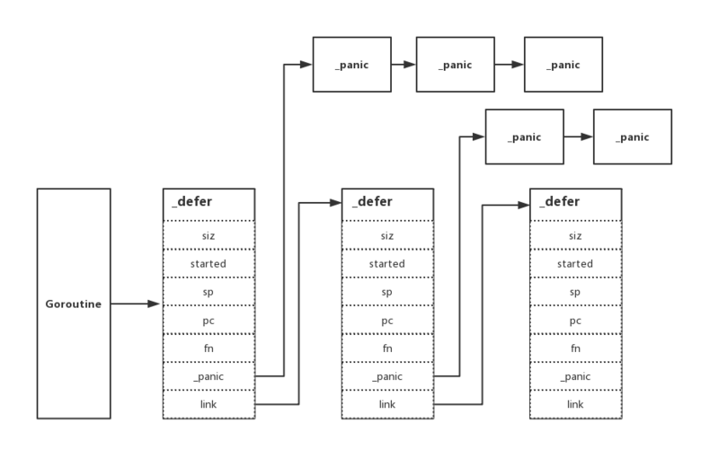

[TOC]
- [defer](#defer)
  * [前言](#--)
  * [defer的定义](#defer---)
  * [defer执行的规则](#defer-----)
  * [为什么需要defer](#-----defer)
  * [defer进阶](#defer--)
    + [作为匿名函数](#------)
    + [作为函数参数](#------)
  * [defer命令执行的时机](#defer-------)
  * [defer配合recover](#defer--recover)
  * [总结](#--)
  * [参考](#--)

## defer

### 前言

defer作为go里面一个延迟调用的机制，它的存在能够大大的帮助我们优化我们的代码结构。但是我们
要弄明白defer的使用机制，不然我们的程序会发生很多莫名的问题。

### defer的定义 

defer用于延迟指定的函数，只能出现在函数的内部，由defer关键字以及指针对某个函数的调用表达式组成。这里被调用的函数
称为延迟函数。

### defer执行的规则

- 当外围函数中的语句执行完毕之时，只有当其中所有的延迟函数都执行完毕，外围函数才会真正的执结束执行。
- 当执行外围函数的return语句时，只有其中所有的延迟函数都执行完毕后，该外围函数才会真正的返回。
- 当外围函数中的代码引起运行恐慌时，只有当其中所有的延迟函数调用到都执行完毕后，该运行恐慌才会真正被扩散至调用函数。

### 为什么需要defer

程序员在编程的时候，经常需要打开一些资源，比如数据库连接、文件、锁等，这些资源需要在用完之后释放掉，否则会造成内存泄漏。  

但是程序员都是人，是人就会犯错。因此经常有程序员忘记关闭这些资源。Golang直接在语言层面提供defer关键字，在打开资源语句的
下一行，就可以直接用defer语句来注册函数结束后执行关闭资源的操作。因为这样一颗“小小”的语法糖，程序员忘写关闭资源语句的情
况就大大地减少了。  

但是，defer并不是非常完美的，defer会有小小地延迟，对时间要求特别特别特别高的程序，可以避免使用它，其他一般忽略它带来的延迟。

当然defer也是不能滥用的，比如下面的  
````go
	i := 0
	rw.Lock()
	i = 2
	defer rw.Unlock()

	rw.Lock()
	i = 6
	defer rw.Unlock()

	fmt.Println(i)
````
defer是在函数退出的时执行的，所以第二个锁，去获取锁的时候，第一个锁还没有释放，所以就报错了。  
当然这是滥用造成的，我们应该去掉defer

### defer进阶

> Each time a “defer” statement executes, the function value and parameters to the call are evaluated as usual and saved anew but the actual function is not invoked. Instead, deferred functions are invoked immediately before the surrounding function returns, in the reverse order they were deferred. If a deferred function value evaluates to nil, execution panics when the function is invoked, not when the “defer” statement is executed.

翻译一下：每次defer语句执行的时候，会把函数“压栈”，函数参数会被拷贝下来；当外层函数（非代码块，如一个for循环）退
出时，defer函数按照定义的逆序执行；如果defer执行的函数为nil, 那么会在最终调用函数的产生panic.  

defer语句并不会马上执行的，而是会进入到一个栈，函数return之前，会按照先后顺序执行。造成的结果就是，先定义的函数最后才会被执行。当然，
这样的设计也是有理由的，后面定义的函数，可能会需要前面定义的函数的资源，如果前面的函数先执行了，后面函数所需要的依赖
可能就不存在了。  

我们来看下defer的数据结构:
````go
type _defer struct {
	siz     int32
	started bool
	sp      uintptr
	pc      uintptr
	fn      *funcval
	_panic  *_panic
	link    *_defer

}
````
- siz：所有传入参数的总大小
- started：该 defer 是否已经执行过
- sp：函数栈指针寄存器，一般指向当前函数栈的栈顶
- pc：程序计数器，有时称为指令指针(IP)，线程利用它来跟踪下一个要执行的指令。在大多数处理器中，PC指向的是下一条指令，而不是当前指令
- fn：指向传入的函数地址和参数
- _panic：指向 _panic 链表
- link：指向 _defer 链表




runtime._defer 结构体是延迟调用链表上的一个元素，所有的结构体都会通过 link 字段串联成链表。  
当有新的_defer被获取，它都会被追加到所在的 Goroutine _defer 链表的最前面。defer 关键字插入时是从后向前的，
而 defer 关键字执行是从前向后的，而这就是后调用的 defer 会优先执行的原因。  

defer对函数的定义时，对外部的引用方式有两种方式，分别是作为函数参数和作为闭包。当然不管是什么形式，defer执行的时候
都是先把前的值保存起来，然后在最后执行调用链的时候，逐个输出。作为函数参数，则在defer定义时就把值传递给defer，并被
cache起来；作为闭包引用的话，则会在defer函数真正调用时根据整个上下文确定当前的值。

那么如何判断是函数还是闭包呢？  
有一句话总结的很好   

> 闭包捕获的变量和常量是引用传递不是值传递  
> 闭包是由函数及其相关引用环境组合而成的实体  
> 闭包=函数+引用环境  

所以总结下就是闭包在发生函数调用时，里面的参数发生的是引用传递，而不是值传递。这样从形式上看，go中的匿名函数都是闭包。

#### 作为匿名函数
举个例子
````go
	for i := 0; i < 3; i++ {
		defer func() {
			fmt.Println(i)
		}()
	}
````
打印下输出
````
3
3
3
````
这个打印的输出全是3,这就是典型的闭包，因为defer保存的变量都指向i，也就是同一个地址，当最后一个循环执行的时候，这个内存地址i的值，被置换成了
3，所以defer里面所有的引用输出的就全是3了，这就是一个典型的闭包。正如上面的那句话总结的，`闭包捕获的变量和常量是引用传递不是值传递`。  

我们可以做个修改，把变量作为函数的参数传递给匿名函数，defer后面跟的就是一个函数调用了
````go
	for i := 0; i < 3; i++ {
		defer func(item int) {
			fmt.Println(item)
		}(i)
	}
````
我们变量i作为参数传递到函数中，我们知道go中函数的参数传递全是值传递，所以i就会被重新copy一份，输出指向的变量就不是i，而是每次被copy的新的
地址空间。

当然我们也可以手动帮助它避免指向同一个地址空间
````go
	for i := 0; i < 3; i++ {
		item := i
		defer func() {
			fmt.Println(item)
		}()
	}
````
输出
````
2
1
0
````

#### 作为函数参数
````go
	for i := 0; i < 3; i++ {
		defer fmt.Println(i)
	}
````
打印下输出
````
2
1
0
````
defer后面跟函数参数，这样的输出就是正常了

### defer命令执行的时机

在分析defer的执行时机之前，我们先看几段代码  
example1
````go
func f() (result int) { 
    defer func() { 
        result++ 
    }() 
    return 0
}
````


example2
````go
func f() (r int) { 
    t := 5 
    defer func() { 
        t = t + 5 
    }() 
    return t
}
````

example3
````go
func f() (r int) { 
    defer func(r int) { 
        r = r + 5 
    }(r) 
    return 1
}
````
我们先想想这个代码的输出，当然如果已经很清楚这个代码的输出，那么我想已经很明白defer的输出机制了。

我们来逐个分析逐个代码的输出  
example1 的代码执行的过程是这样的
````go
func f() (result int) {
	result = 0 //return语句不是一条原子调用，return xxx其实是赋值＋RET指令
	func() { //defer被插入到return之前执行，也就是赋返回值和RET指令之间
		result++
	}()
	return
}
````
所以上面的输出结果是1  

再来分析example2,他可以被拆解为
````go
func f() (r int) {
	t := 5
	r = t    //赋值指令
	func() { //defer被插入到赋值与返回之间执行，这个例子中返回值r没被修改过
		t = t + 5
	}()
	return //空的return指令
}
````
所以他的输出是5

接下来分析example3,它的命令可以被拆解为  
````go
func f() (r int) {
	r = 1         //给返回值赋值
	func(r int) { //这里改的r是传值传进去的r，不会改变要返回的那个r值
		r = r + 5
	}(r)
	return //空的return
}
````
因为匿名函数r作为参数传进去了，go中函数之前参数的传递都是值传递，所以匿名函数里面的r是被重新复制了一份，指针的指向是新的
地址空间。所以这个的输出是1。  


那么我们可以来总结下defer的执行过程
````
1、返回值 = xxx

2、调用defer函数

3、空的return
````
所以我们看到defer的执行总是在return之前，并且总是先赋值，然后执行defer语句的。


### defer配合recover


>``Panic`` is a built-in function that stops the ordinary flow of control and begins panicking. When the function F calls panic, execution of F stops, any deferred functions in F are executed normally, and then F returns to its caller. To the caller, F then behaves like a call to panic. The process continues up the stack until all functions in the current goroutine have returned, at which point the program crashes. Panics can be initiated by invoking panic directly. They can also be caused by runtime errors, such as out-of-bounds array accesses.
 
>``Recover`` is a built-in function that regains control of a panicking goroutine. Recover is only useful inside deferred functions. During normal execution, a call to recover will return nil and have no other effect. If the current goroutine is panicking, a call to recover will capture the value given to panic and resume normal execution.

``Panic``是一个内置函数，可停止常规控制流并开始恐慌。 当函数F调用恐慌时，F的执行停止，F中任何延迟的函数都将正常执行，然后F返回其调用方。 对于呼叫者，F然后表现得像是发生了恐慌。 该过程将继续执行堆栈，直到返回当前goroutine中的所有函数为止，此时程序崩溃。 紧急事件可以通过直接调用紧急事件来启动。 它们也可能是由运行时错误引起的，例如越界数组访问。

``恢复``是一个内置函数，可以重新获得对紧急恐慌例程的控制。 恢复仅在延迟函数内部有用。 在正常执行期间，恢复调用将返回nil并且没有其他效果。 如果当前goroutine处于恐慌状态，则调用recover会捕获提供给panic的值并恢复正常执行。

````go
func main() {
    f()
    fmt.Println("Returned normally from f.")
}

func f() {
    defer func() {
        if r := recover(); r != nil {
            fmt.Println("Recovered in f", r)
        }
    }()
    fmt.Println("Calling g.")
    g(0)
    fmt.Println("Returned normally from g.")
}

func g(i int) {
    if i > 3 {
        fmt.Println("Panicking!")
        panic(fmt.Sprintf("%v", i))
    }
    defer fmt.Println("Defer in g", i)
    fmt.Println("Printing in g", i)
    g(i + 1)
}
````
打印下输出
````
Calling g.
Printing in g 0
Printing in g 1
Printing in g 2
Printing in g 3
Panicking!
Defer in g 3
Defer in g 2
Defer in g 1
Defer in g 0
Recovered in f 4
Returned normally from f.
````
我们发现，上面的函数有一个递归，知道函数在4的时候发生panic，这是通过defer挂起的recover就起作用了，它会帮助我们，从
恐慌中恢复，从后往前恢复当前goroutine中所有的函数。  

上面的demo，充分说明了defer配合recover的作用。能够帮助我们从异常中恢复。  

不过在处理defer相关的时候，我们越早处理越好。因为panic在发生的时候，是从当前截止，向上去寻找defer定义的函数，然后一个个
执行。但是如果,defer定义到了panic那么后面的将不会执行了。

### 总结

处理defer的时候我们越早越好，defer的执行是从下往上执行的，defer的执行总是在return之前，并且总是先赋值，然后执行defer语句的。
对于defer调用匿名函数，我们需要变量的引用，避免发生闭包，出现莫名的错误。同时defer是存在性能问题的，对于性能要求高的我们还是要
考虑放弃使用defer。

### 参考
【go语言并发编程实战】   
【Golang之轻松化解defer的温柔陷阱】https://www.cnblogs.com/qcrao-2018/p/10367346.html#%E4%BB%80%E4%B9%88%E6%98%AFdefer  
【golang的defer精析】https://my.oschina.net/yuwenc/blog/300592  
【深入理解 Go defer】https://segmentfault.com/a/1190000019303572  
【go defer,panic,recover详解 go 的异常处理】https://www.jianshu.com/p/63e3d57f285f  
【go defer,panic,recover-需要梯子】https://blog.golang.org/defer-panic-and-recover  