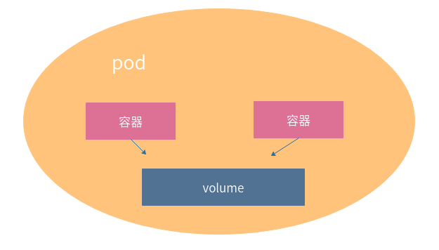

<!-- START doctoc generated TOC please keep comment here to allow auto update -->
<!-- DON'T EDIT THIS SECTION, INSTEAD RE-RUN doctoc TO UPDATE -->

- [k8s中pod的理解](#k8s%E4%B8%ADpod%E7%9A%84%E7%90%86%E8%A7%A3)
    - [基本概念](#%E5%9F%BA%E6%9C%AC%E6%A6%82%E5%BF%B5)
    - [pod存在的意义](#pod%E5%AD%98%E5%9C%A8%E7%9A%84%E6%84%8F%E4%B9%89)
    - [pod容器分类与设计模式](#pod%E5%AE%B9%E5%99%A8%E5%88%86%E7%B1%BB%E4%B8%8E%E8%AE%BE%E8%AE%A1%E6%A8%A1%E5%BC%8F)
    - [实现机制](#%E5%AE%9E%E7%8E%B0%E6%9C%BA%E5%88%B6)
      - [共享存储](#%E5%85%B1%E4%BA%AB%E5%AD%98%E5%82%A8)
      - [共享网络](#%E5%85%B1%E4%BA%AB%E7%BD%91%E7%BB%9C)
  - [pod的生命周期和重启策略](#pod%E7%9A%84%E7%94%9F%E5%91%BD%E5%91%A8%E6%9C%9F%E5%92%8C%E9%87%8D%E5%90%AF%E7%AD%96%E7%95%A5)
    - [Replication Controller](#replication-controller)
    - [Replica Set](#replica-set)
    - [Deployment](#deployment)
    - [DaemonSet](#daemonset)
    - [StatefulSet](#statefulset)
  - [Horizontal Pod Autoscaler](#horizontal-pod-autoscaler)
  - [pod的健康检查](#pod%E7%9A%84%E5%81%A5%E5%BA%B7%E6%A3%80%E6%9F%A5)
  - [资源限制](#%E8%B5%84%E6%BA%90%E9%99%90%E5%88%B6)
  - [参考](#%E5%8F%82%E8%80%83)

<!-- END doctoc generated TOC please keep comment here to allow auto update -->

## k8s中pod的理解  

#### 基本概念

Pod 是 Kubernetes 集群中能够被创建和管理的最小部署单元,它是虚拟存在的。pod是一组容器的集合，并且部署在同一个pod里面
的容器是亲密性很强的一组容器，pod里面的容器，共享网络和存储空间，pod是短暂的。  
关键词：   
- 1、最小的部署单元  
- 2、一组容器的集合 （亲密性强）
- 3、一个pod里面的容器共享网络和存储空间  
- 4、pod是短暂的  

#### pod存在的意义

为亲密应用而存在  
 
亲密性应用场景   
1、两个应用之间发生文件交换  
2、两个应用需要通过127.0.0.1或者socket通信  
3、两个应用需要发生频繁的调用  

#### pod容器分类与设计模式

- Infrastructure Container：基础容器,也叫sandbox或pause容器
维护整个Pod网络空间 
- InitContainers：初始化容器   
 先于业务容器开始执行，让一些有依赖的容器有个先后执行的顺序
- Containers：业务容器  
 并行  
 
 ````
 // SyncPod syncs the running pod into the desired pod by executing following steps:
 //
 //  1. Compute sandbox and container changes.
 //  2. Kill pod sandbox if necessary.
 //  3. Kill any containers that should not be running.
 //  4. Create sandbox if necessary.
 //  5. Create ephemeral containers.
 //  6. Create init containers.
 //  7. Create normal containers.
 func (m *kubeGenericRuntimeManager) SyncPod(pod *v1.Pod, podStatus *kubecontainer.PodStatus, pullSecrets []v1.Secret, backOff *flowcontrol.Backoff) (result kubecontainer.PodSyncResult) {
        ...
 }
 ````
#### 实现机制

共享网络  
共享存储  

##### 共享存储
在同一个pod中的多个容器能够共享pod级别的存储卷Volume.Volume可以被多个容器进行挂载的操作。  
为什么要共享存储呢?  
pod的生命周期短暂的，随时可能被删除和重启，当一个pod被删除了，又启动一个pod，共享公共的存储卷，以至于信息不会丢失。



##### 共享网络
同一个pod的多个容器，会被共同分配到同一个Host上共享网络栈。所以pod里面的容器通过localhost就可以通信了。当然这也从侧面
说明了，为什么pod是为了亲密性的应用而生的。   
docker的4中网络模式，其中有一种模式是container模式，它能够让很多容器共享一个网络名称空间， 具体的原理是先使用briage模式启动第一个容器， 之后
启动的其他容器纷纷使用container模式将网络环境绑定到这第一个容器上。这样这些容器的网络就连接到了一起，他们互相可以使用
localhost这种方式进行网络通信。  
  


如上图所示，这个 Pod 里有两个用户容器 A 和 B，还有一个infra container， 它也叫做pause容器，也被称为sandbox， 意思是沙箱，这个沙箱为其他
容器提供共享的网络和文件挂载资源。 pod在启动的时候Infrastructure Container是第一个启动的容器，也叫做pause容器，也被称为sandbox。之后才启动
InitContainers初始化容器和Containers业务容器。而当这个容器被创建出来并hold住Network Namespace之后，其他由用户自己定义的容器就可以通过
container模式加入到这个容器的Network Namespace中。这也就意味着，对于在一个POD中的容器A和容器B来说，他们拥有相同的IP地址，可以通过
localhost进行互相通信。   

````
// RunPodSandbox creates and starts a pod-level sandbox. Runtimes should ensure
// the sandbox is in ready state.
// For docker, PodSandbox is implemented by a container holding the network
// namespace for the pod.
// Note: docker doesn't use LogDirectory (yet).
func (ds *dockerService) RunPodSandbox(ctx context.Context, r *runtimeapi.RunPodSandboxRequest) (*runtimeapi.RunPodSandboxResponse, error) {
	config := r.GetConfig()

	// Step 1: Pull the image for the sandbox.
	image := defaultSandboxImage
	podSandboxImage := ds.podSandboxImage
	if len(podSandboxImage) != 0 {
		image = podSandboxImage
	}

	// Step 2: Create the sandbox container.
	if r.GetRuntimeHandler() != "" && r.GetRuntimeHandler() != runtimeName {
		return nil, fmt.Errorf("RuntimeHandler %q not supported", r.GetRuntimeHandler())
	}

	// Step 3: Create Sandbox Checkpoint.
	if err = ds.checkpointManager.CreateCheckpoint(createResp.ID, constructPodSandboxCheckpoint(config)); err != nil {
		return nil, err
	}

	// Step 4: Start the sandbox container.
	// Assume kubelet's garbage collector would remove the sandbox later, if
	// startContainer failed.
	err = ds.client.StartContainer(createResp.ID)
	if err != nil {
		return nil, fmt.Errorf("failed to start sandbox container for pod %q: %v", config.Metadata.Name, err)
	}

	// Step 5: Setup networking for the sandbox.
	// All pod networking is setup by a CNI plugin discovered at startup time.
	// This plugin assigns the pod ip, sets up routes inside the sandbox,
	// creates interfaces etc. In theory, its jurisdiction ends with pod
	// sandbox networking, but it might insert iptables rules or open ports
	// on the host as well, to satisfy parts of the pod spec that aren't
	// recognized by the CNI standard yet.
	cID := kubecontainer.BuildContainerID(runtimeName, createResp.ID)

	return resp, nil
}
````

### pod的生命周期和重启策略

pod在运行的过程中会被定义为各种状态，了解一些状态能帮助我们了解pod的调度策略。  
当 Pod 被创建之后，就会进入健康检查状态，当 Kubernetes 确定当前 Pod 已经能够接受外部的请求时，才会将流量打到
新的 Pod 上并继续对外提供服务，在这期间如果发生了错误就可能会触发重启机制。  
pod的重启策略包括  
- Always 只要失败，就会治重启
- OnFile 当容器终止运行，且退出吗不是0，就会重启
- Never  从来不会重启

重启的时间，是以2n来算。比如1,2,4,8.....最长延迟５分钟，并且在成功重启后的10分钟重置这个时间。

管理pod的重启策略是靠控制器来完成的  

#### Replication Controller

RC的作用是声明Pod的副本数量在任意时刻都符合某个预期值，所以RC的定义包括如下几个部分。  

- Pod期待的副本数量（replicas）。
- 用于筛选目标Pod的Label Selector。
- 当Pod的副本数量小于预期数量时，用于创建新Pod的Pod模板（template）。

下面是一个完整的RC定义的例子，即确保拥有tier=frontend标签的这个Pod（运行Tomcat容器）在整个Kubernetes集群中始终有三个副本  

```
apiVersion: v1
kind: ReplicationController
metadata:
  name: frontend
spec:
  replicas: 3
  selector:
    tier: frontend
  template:
    metadata:
      labels:
        app: app-demo
        tier: frontend
    spec:
      containers:
      - name: tomcat-demo
        image: tomcat
        imagePullPolicy: IfNotPresent
        env:
        - name: GET_HOSTS_FROM
          value: dns
        ports:
        - containerPort: 80
```
当我们定义了一个RC并提交到Kubernetes集群中后，Master节点上的Controller Manager组件就得到通知，定期巡检系统中当前存活的目标Pod，并确保目
标Pod实例的数量刚好等于此RC的期望值。如果有过多的Pod副本在运行，系统就会停掉多余的Pod；如果运行的Pod副本少于期望值，即如果某个Pod挂掉，系统就
会自动创建新的Pod以保证数量等于期望值。  

通过RC，Kubernetes实现了用户应用集群的高可用性，并且大大减少了运维人员在传统IT环境中需要完成的许多手工运维工作（如主机监控脚本、应用监控脚本、故障恢复脚本等）。  

#### Replica Set

由于Replication Controller与Kubernetes代码中的模块Replication Controller同名，同时这个词也无法准确表达它的意思，所以从Kubernetes v1.2开
始，它就升级成了另外一个新的对象——Replica Set，官方解释为“下一代的RC”。ReplicaSet和ReplicationController没有本质区别，只是名字名字不一样，
并且ReplicaSet支持集合式的selector。虽然ReplicaSet可以独立使用，但一般还是建议使用Deployment来自动管理ReplicaSet。这样就无需担心跟其他机制不兼容
的问题（比如ReplicaSet不支持roling-update但Deployment支持）。     

```
apiVersion: extensions/v1beta1
kind: ReplicaSet
metadata:
  name: frontend
spec:
  selector:
    matchLabels:
      tier: frontend
    matchExpressions:
      - {key: tier, operator: In, values: [frontend]}
  template:
  …………
```    

RC和RS的特性与作用如下：  

- 在大多情况下，我们通过定义一个RC实现Pod的创建过程及副本数量的自动控制。
- RC里包括完整的Pod定义模板。
- RC通过Label Selector机制实现对Pod副本的自动控制。
- 通过改变RC里的Pod副本数量，可以实现Pod的扩容或缩容功能。
- 通过改变RC里Pod模板中的镜像版本，可以实现Pod的滚动升级功能。

#### Deployment

Deployment相对于RC的最大区别是我们可以随时知道当前Pod“部署”的进度。一个Pod的创建、调度、绑定节点及在目标Node上启动对应的容器这一完整过程需要
一定的时间，所以我们期待系统启动N个Pod副本的目标状态，实际上是一个连续变化的“部署过程”导致的最终状态。  

Deployment的典型使用场景有以下几个：  

- 创建一个Deployment对象来生成对应的Replica Set并完成Pod副本的创建过程。  
- 检查Deployment的状态来看部署动作是否完成（Pod副本的数量是否达到预期的值）。  
- 更新Deployment以创建新的Pod（比如镜像升级）。
- 如果当前Deployment不稳定，则回滚到一个早先的Deployment版本。
- 暂停Deployment以便于一次性修改多个Pod Template Spec的配置项，之后再恢复Deployment，进行新的发布。
- 扩展Deployment以应对高负载。
- 查看Deployment的状态，以此作为发布是否成功的指标。
- 清理不再需要的旧版本ReplicaSet。

Deployment的定义与Replica Set的定义类似，只是API声明与Kind类型不同。  

```
apiVersion: extensions/v1beta1
kind: Deployment
metadata:
  name: nginx-deployment
```

```
apiVersion: v1
kind: ReplicaSet
metadata:
  name: nginx-repset
```

下面是Deployment定义的一个完整例子  

```
apiVersion: extensions/v1beta1
kind: Deployment
metadata:
  name: frontend
spec:
  replicas: 1
  selector:
    matchLabels:
      tier: frontend
    matchExpressions:
      - {key: tier, operator: In, values: [frontend]}
  template:
    metadata:
      labels:
        app: app-demo
        tier: frontend
    spec:
      containers:
      - name: tomcat-demo
        image: tomcat
        imagePullPolicy: IfNotPresent
        ports:
        - containerPort: 8080
```

可以通过命令kubectl get deployment来查看Deployment的信息，其中的几个参数解释如下：  

- DESIRED:：Pod副本数量的期望值，即Deployment里定义的Replica。
- CURRENT：当前Replica的值，如果小于DESIRED的期望值，会创建新的Pod，直到达成DESIRED为止。
- UP-TO-DATE：最新版本的Pod的副本数量，用于指示在滚动升级的过程中，有多少个Pod副本已经成功升级。
- AVAILABLE：当前集群中可用的Pod副本数量，即集群中当前存活的Pod数量。

#### DaemonSet

DaemonSet 确保全部（或者某些）节点上运行一个 Pod 的副本。 当有节点加入集群时， 也会为他们新增一个 Pod 。 当有节点从集群移除时，这些 Pod 也
会被回收。删除 DaemonSet 将会删除它创建的所有 Pod。  

DaemonSet 的一些典型用法：  

- 在每个节点上运行集群守护进程
- 在每个节点上运行日志收集守护进程
- 在每个节点上运行监控守护进程

一种简单的用法是为每种类型的守护进程在所有的节点上都启动一个 DaemonSet。 一个稍微复杂的用法是为同一种守护进程部署多个 DaemonSet；每个具有不
同的标志， 并且对不同硬件类型具有不同的内存、CPU 要求。  

```
apiVersion: apps/v1
kind: DaemonSet
metadata:
  name: fluentd-elasticsearch
  namespace: kube-system
  labels:
    k8s-app: fluentd-logging
spec:
  selector:
    matchLabels:
      name: fluentd-elasticsearch
  template:
    metadata:
      labels:
        name: fluentd-elasticsearch
    spec:
      tolerations:
      # this toleration is to have the daemonset runnable on master nodes
      # remove it if your masters can't run pods
      - key: node-role.kubernetes.io/master
        effect: NoSchedule
      containers:
      - name: fluentd-elasticsearch
        image: quay.io/fluentd_elasticsearch/fluentd:v2.5.2
        resources:
          limits:
            memory: 200Mi
          requests:
            cpu: 100m
            memory: 200Mi
        volumeMounts:
        - name: varlog
          mountPath: /var/log
        - name: varlibdockercontainers
          mountPath: /var/lib/docker/containers
          readOnly: true
      terminationGracePeriodSeconds: 30
      volumes:
      - name: varlog
        hostPath:
          path: /var/log
      - name: varlibdockercontainers
        hostPath:
          path: /var/lib/docker/containers
```

#### StatefulSet

Pod的管理对象RC、Deployment、DaemonSet和Job都是面向无状态的服务，但实际中有很多服务是有状态的，比如Mysql集群、MongoDB集群、ZooKeeper集
群等，可以使用StatefulSet来管理有状态的服务。  

StatefulSet有如下一些特性：  

- 稳定的、唯一的网络标识符。
- 稳定的、持久的存储。通过PV/PVC来实现，删除Pod时默认不会删除与StatefulSet相关的存储卷（为了保证数据的安全）。  
- 有序的、优雅的部署和缩放。操作第n个Pod时，前n-1个Pod已经是运行且准备好的状态。  
- 有序的、自动的滚动更新。

StatefulSet除了要与PV卷捆绑使用以存储Pod的状态数据，还要与`Headless Service`配合使用，即在每个StatefulSet的定义中要声明它属于哪个`Headless Service`。
`Headless Service`与普通Service的区别在于，它没有Cluster IP，如果解析`Headless Service`的DNS域名，则返回的是该Service对应的全部Pod的Endpoint列表。
StatefulSet在`Headless Service`的基础上又为StatefulSet控制的每个Pod实例创建了一个DNS域名，这个域名的格式为：   

```
$(podname).$(headless service name)
```

比如一个3节点的kafka的StatefulSet集群，对应的Headless Service的名字为kafka，StatefulSet的名字为kafka，则StatefulSet里面的3个Pod的DNS
名称分别为kafka-0.kafka、kafka-1.kafka、kafka-3.kafka，这些DNS名称可以直接在集群的配置文件中固定下来。  

### Horizontal Pod Autoscaler

在Kubernetes 1.1中首次发布重量级新特性—Horizontal Pod Autoscaling（Pod横向自 动扩容，HPA）,从1.6版 本开始，增强了根据应用自定义的指标进行
自动扩容和缩容的功能，API版本为autoscali ng/v2alpha1，并不断演进。  

HPA与之前的RC、Deployment一样，也属于一种Kubernetes资源对象。通过追踪分析 指定RC控制的所有目标Pod的负载变化情况，来确定是否需要有针对性地调
整目标Pod的副 本数量，这是HPA的实现原理。当前，HPA有以下两种方式作为Pod负载的度量指标。  

- CPUUtilizationPercentage。
- 应用程序自定义的度量指标，比如服务在每秒内的相应请求数（TPS或QPS）。

CPUUtilizationPercentage是一个算术平均值，即目标Pod所有副本自身的CPU利用率 的平均值。  

如何计算的呢？  

一个Pod自身的CPU利用率是该Pod当前CPU的使用量除以它的Pod Request的值。  

举个例子：比如定义一个Pod的Pod Request为0.4，而当前Pod的CPU使用量为0.2，则它的CPU使用率 为50%，这样就可以算出一个RC控制的所有Pod副本的CPU利用率的算术平均值了。  

一般会在CPUUtilizationPercentage超过80%的时候考虑进行动态扩容。  

在CPUUtilizationPercentage计算过程中,我们通常取得是1分钟之内的p平均值，通常通过查询Heapster监控子系统来得到这个值。从1.7版本开始，Kubernetes自
身孵化了一个基础性能数据采集监控框架——Kubernetes Monitoring Architecture，从 而更好地支持HPA和其他需要用到基础性能数据的功能模块。  

下面是HPA定义的一个具体例子

```
apiVersion: autoscaling/v1
kind: HorizontalPodAutoscaler
metadata:
  name: php-apache
  namespace: default
spec:
  maxReplicas: 10
  minReplicas: 2
  scaleTargetRef:
    kind: Deployment
    name: php-apache
  targetCPUUtilizationPercentage: 90
```

上面定义了一个目标对象为一个名为php-apache的Dep loyment里的Pod副本，当这些Pod副本的CPUUtilizationPercentage的值超过90%时会触发 自动动
态扩容行为，在扩容或缩容时必须满足的一个约束条件是Pod的副本数为1～10。  

当然也可以通过命令的方式来创建  

```
$ kubectl autoscale deployment php-apache --cpu-percent=90 --min=1 --max=10
```


### pod的健康检查
对于pod的健康检查一般有两种探针来进行操作,果我们配置了合适的健康检查方法和规则，那么就不会出现服务未启动就被打入流量
或者长时间未响应依然没有重启等问题。
- LivenessProbe探针：用于判断容器是否存活（Running状态），LivenessProbe如果检测到容器不健康，那么就会杀掉该容器
，然后根据重启策略进行相应的操作。如果一个容器中不含有探针，那么会Kubelet会认为该容器的LivenessProbe探针的值返回
永远是“success”。
- ReadinessProbe:用于判断是否启动完成（ready状态），可以接收请求。

Kubelet定期执行LivenessProbe来检查容器的状态，一般有三种的实现方式:

- ExecAction:在容器内部执行一个命令，如果该命令的返回码为0，则表示健康。
- TcpSocketAction:通过容器的IP地址和端口号执行TCP检查。如果能建立ＴＣＰ连接，就表示健康。
- HTTPGetAction:通过容器的IP地址、端口及路径调用HTTP Get方法，如果相应的状态码大于等于200且小于等于400，则认为
容器是健康状态。 

### 资源限制

每个Pod都可以对其能使用的服务器上的计算资源设置限额，当前可以设置限额的计算资源有CPU和Memory两种，其中CPU的资源单位为CPU（Core）的数量，是一个绝对值。  

对于容器来说一个CPU的配额已经是相当大的资源配额了，所以在Kubernetes里，通常以千分之一的CPU配额为最小单位，用m来表示。通常一个容器的CPU配额被
定义为100-300m，即占用0.1-0.3个CPU。与CPU配额类似，Memory配额也是一个绝对值，它的单位是内存字节数。  

对计算资源进行配额限定需要设定以下两个参数：  

- Requests：该资源的最小申请量，系统必须满足要求。
- Limits：该资源最大允许使用的量，不能超过这个使用限制，当容器试图使用超过这个量的资源时，可能会被Kubernetes Kill并重启。

通常我们应该把Requests设置为一个比较小的数值，满足容器平时的工作负载情况下的资源需求，而把Limits设置为峰值负载情况下资源占用的最大量。下面是一个资源配额的简单定义：  

```
spec:
  containers:
  - name: db
    image: mysql
    resources:
      requests:
        memory: "64Mi"
        cpu: "250m"
      limits:
        memory: "128Mi"
        cpu: "500m"
```

最小0.25个CPU及64MB内存，最大0.5个CPU及128MB内存。  

### 参考
【初识Kubernetes（K8s）：各种资源对象的理解和定义】https://blog.51cto.com/andyxu/2329257  
【Kubernetes系列学习文章 - Pod的深入理解（四）】https://cloud.tencent.com/developer/article/1443520  

