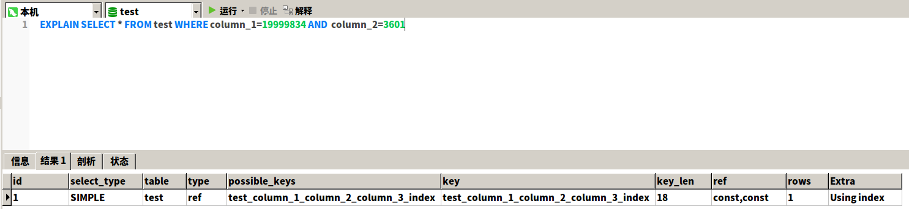
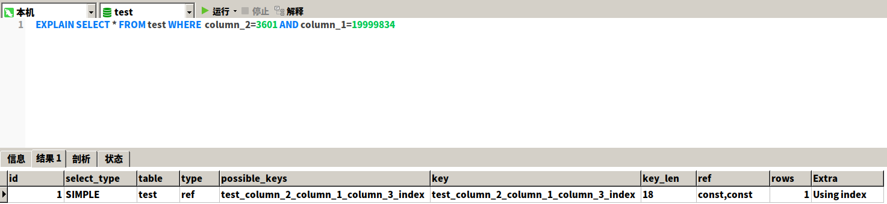

# 组合索引的最左匹配原则

## 前言

对于组合索引我们知道，在使用的时候有一个最左前缀的原则，除了这些呢，比如字段放置的位置，
会不会对索引的效率产生影响呢？

## 最左匹配原则

联合索引时会遵循最左前缀匹配的原则，即最左优先，在检索数据时从联合索引的最左边开始匹配，示例：
````
create table test
(
    id       bigint auto_increment
        primary key,
    column_1 bigint null,
    column_2 bigint null,
    column_3 bigint null
);

create index test_column_1_column_2_column_3_index
    on test (column_1, column_2, column_3);
````
比如上面的test表，我们建立了联合索引``index test_column_1_column_2_column_3_index on test (column_1, column_2, column_3);``
当我们进行查询的时候，按照最左前缀的原则，当查询(column_1)、(column_1,column_2)、(column_1,column_2,column_3)这三种组合是可以用到
我们定义的联合索引的。如果我们查询(column_1,column_3)就只能用到column_1的索引了。我们不用太关心索引的先后顺序，什么意思呢？
比如使用(column_1,column_2)和(column_2,column_1)的效果是一样的，数据库的查询优化器会自动帮助我们优化我们的sql，看哪个执行的效率最高，
最后才生成最后执行的sql。

#### 为什么会有最左前缀呢？  

当使用b+树作为索引的存储数据结构时，当我们创建联合索引的时候，比如(column_1, column_2, column_3)，b+树建立索引是从左
到右来建立搜索树的，比如当我们来查询的时候``WHERE column_1 = 1 AND column_2 = 2 AND column_3 = 3``。b+树会先通过最
左边的（建立索引的字段的左边的字段）字段，也就是``column_1``来确定下一步的查找对象，然后找到column_2，在通过column_2的
索引找到column_3。所以(column_2,column_3)这样的查询命中不到索引了。因为最左前缀，一定是从最左边的字段开始依次在b+树的子节点
查询，然后确定下一个查找的子节点的数据。所以我们(column_1)、(column_1,column_2)、(column_1,column_2,column_3)这三种查询
条件是可以使用到索引的。

#### 联合索引的存储结构

定义联合索引(员工级别，员工姓名，员工出生年月)，将联合索引按照索引顺序放入节点中，新插入节点时，先按照联合索引中的员工级别比较，如果相同会按照是员工姓名比较，如果员工级别和员工姓名都相同 最后是员工的出生年月比较。可以从图中从上到下，从左到右看，第一个B+树的节点 是通过联合索引的员工级别比较的，第二个节点是 员工级别相同，会按照员工姓名比较，第三个节点是  员工级别和员工姓名都相同，会按照员工出生年月比较。


#### 联合索引字段的先后顺序

我们定义多个字段的联合索引，会考虑到字段的先后顺序。那么字段的先后顺序真的会对查询的效率产生影响吗？比如上面的联合索引
``index test_column_1_column_2_column_3_index on test (column_1, column_2, column_3);``和``index test_column_1_column_2_column_3_index on test (column_2, column_1, column_3);``
在查询效率上有差别吗？我们试验下  
写个函数批量插入下数据  
````
CREATE PROCEDURE dowhile()
BEGIN
  DECLARE v1 INT DEFAULT 20000000;

  WHILE v1 > 0 DO
    INSERT INTO test.test (column_1, column_2, column_3) VALUES (RAND() * 20000000, RAND() * 10000, RAND() * 20000000);
    SET v1 = v1 - 1;
END WHILE;
END;
````
我们插入了20000000条数据，然后先设置索引(column_1, column_2, column_3)中column_1的数值范围为0到20000000，column_2的范围为0到10000。
然后查询，看看这个索引的效率。数据量太大，插入的时间可能要好久。为什么插入20000000条呢，因为b+树可以高效存储的数据条数就是21902400，具体见下文。

我们尝试下查询的效率  
````
SELECT * FROM test WHERE column_1=19999834 AND  column_2=3601
> OK
> 时间: 0.001s

EXPLAIN SELECT * FROM test WHERE column_1=19999834 AND  column_2=3601
````


我们看到索引的type为ref已经相当高效了。  

type：这列最重要，显示了连接使用了哪种类别,有无使用索引，是使用Explain命令分析性能瓶颈的关键项之一。  
结果值从好到坏依次是：  
``
system > const > eq_ref > ref > fulltext > ref_or_null > index_merge > unique_subquery > index_subquery > range > index > ALL
``
一般来说，得保证查询至少达到range级别，最好能达到ref，否则就可能会出现性能问题。  

然后我们看下插入的效率
````
INSERT INTO test.test (column_1, column_2, column_3) VALUES (RAND() * 20000000, RAND() * 10000, RAND() * 20000000)
> Affected rows: 1
> 时间: 0.002s 
````

更改索引的顺序  
````
drop index test_column_1_column_2_column_3_index on test;

create index test_column_2_column_1_column_3_index
	on test (column_2, column_1, column_3); 
````
我们把``column_2``和``column_1``的索引位置更换了一下，来比较联合索引的先后顺序对查询效率的影响。  

````
SELECT * FROM test WHERE  column_2=3601 AND column_1=19999834
> OK
> 时间: 0.001s

EXPLAIN SELECT * FROM test WHERE  column_2=3601 AND column_1=19999834 
````


发现更换了之后查询时间上没有什么出入，还和上个查询的时间一样，分析查询的效率一样很高。  

再来看插入的效率  
````
INSERT INTO test.test (column_1, column_2, column_3) VALUES (RAND() * 20000000, RAND() * 10000, RAND() * 20000000)
> Affected rows: 1
> 时间: 0.003s
````
依然高效  

所以我们可以总结出来，联合索引中字段的先后顺序，在sql层面的执行效率，差别不大，是可以忽略的。分析上面索引的数据结构也是可以推断出来的，无非
就是当建立联合索引，更换索引字段的先后顺序，匹配每个字段锁定的数据条数不一样，但是对最终的查询效率没有太大的影响。但是这个字段的顺序真的就不用考虑吗？
不是的，我们知道有最左匹配原则，所以我们要考虑我们的业务，比如说我们的业务场景中有一个字段enterpriseId,这个字段在80%的查询场景中都会遇到，那么
我们肯定首选将这个字段放在联合索引字段的第一个位置，这样就能保证查询的高效，能够命中我们建立的索引。

#### b+树可以存储的数据条数

b+树 正常的高度是``（1~3）``一个整型``8b`` 指针占用``6b``，mysql页文件默认``16K``，``16k``的数据可以存储``16/14b=1170 ``
三层的数据大概就是``1170*1170*16=21902400``（千万条数据）所以千万级别的数据，对于建了索引的数据库查询的数据库也是很快的。  

#### 总结

对于联合索引，我们不能忽略它的最左匹配原则，即在检索数据时从联合索引的最左边开始匹配。对于创建联合索引时，我们要根据我们的具体的查询场景来定，联合索引
字段的先后顺序，联合索引字段的先后顺序在sql层面上没有太大差别,但是结合查询的场景和最左匹配的原则，就能使一些查询的场景不能很好的命中索引，这点使我们
是不能忽略的。


### 参考
【最左匹配原则的理解】https://blog.csdn.net/u013164931/article/details/82386555  
【深入理解Mysql索引底层数据结构与算法】https://juejin.im/post/5d5c85d4f265da039f12ba97   
【MySQL技术内幕  InnoDB存储引擎  第2版】