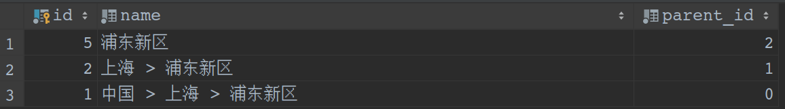

## RECURSIVE

### 前言

WITH提供了一种方式来书写在一个大型查询中使用的辅助语句。这些语句通常被称为公共表表达式或CTE，它们可以被看成是定义只在一个查询中存在的临时表。在WITH子句中的每一个辅助语句可以是一个SELECT、INSERT、UPDATE或DELETE，并且WITH子句本身也可以被附加到一个主语句，主语句也可以是SELECT、INSERT、UPDATE或DELETE。

### CTE or WITH

WITH语句通常被称为通用表表达式（Common Table Expressions）或者CTEs。  

WITH语句作为一个辅助语句依附于主语句，WITH语句和主语句都可以是SELECT，INSERT，UPDATE，DELETE中的任何一种语句。  

举个栗子  
````sql
WITH result AS (
    SELECT d.user_id
    FROM documents d
    GROUP BY d.user_id
),info as(
    SELECT t.*,json_build_object('id', ur.id, 'name', ur.name) AS user_info
    FROM result t
    LEFT JOIN users ur on ur.id = t.user_id
    WHERE ur.id IS NOT NULL
)select * from info
````
定义了两个WITH辅助语句，result和info。result查询出符合要求的user信息，然后info对这个信息进行组装，组装出我们需要的
数据信息。

当然不用这个也是可以的，不过CTE主要的还是做数据的过滤。什么意思呢，我们可以定义多层级的CTE，然后一层层的查询过滤组装。最终筛选出我们
需要的数据，当然你可能会问为什么不一次性拿出所有的数据呢，当然如果数据很大，我们通过多层次的数据过滤组装，在效率上也更好。

### 在WITH中使用数据修改语句

WITH中可以不仅可以使用SELECT语句，同时还能使用DELETE，UPDATE，INSERT语句。因此，可以使用WITH，在一条SQL语句中进行不同的操作，如下例所示。

````sql
WITH moved_rows AS (
  DELETE FROM products
  WHERE
    "date" >= '2010-10-01'
  AND "date" < '2010-11-01'
  RETURNING *
)
INSERT INTO products_log
SELECT * FROM moved_rows;
````
本例通过WITH中的DELETE语句从products表中删除了一个月的数据，并通过RETURNING子句将删除的数据集赋给moved_rows这一CTE，最后在主语句中通过INSERT将删除的商品插入products_log中。

如果WITH里面使用的不是SELECT语句，并且没有通过RETURNING子句返回结果集，则主查询中不可以引用该CTE，但主查询和WITH语句仍然可以继续执行。这种情况可以实现将多个不相关的语句放在一个SQL语句里，实现了在不显式使用事务的情况下保证WITH语句和主语句的事务性，如下例所示。

````sql
WITH d AS (
  DELETE FROM foo
),
u as (
  UPDATE foo SET a = 1
  WHERE b = 2
)
DELETE FROM bar;
````

The sub-statements in WITH中的子语句被和每一个其他子语句以及主查询并发执行。因此在使用WITH中的数据修改语句时，指定更新的顺序实际是以不可预测的方式发生的。RETURNING数据是在不同WITH子语句和主查询之间传达改变的唯一方法。
````sql
WITH t AS (
    UPDATE products SET price = price * 1.05
    RETURNING *
)
SELECT * FROM products;
````
外层SELECT可以返回在UPDATE动作之前的原始价格，而在
````sql
WITH t AS (
    UPDATE products SET price = price * 1.05
    RETURNING *
)
SELECT * FROM t;
````
外部SELECT将返回更新过的数据。


### WITH使用注意事项

1、WITH中的数据修改语句会被执行一次，并且肯定会完全执行，无论主语句是否读取或者是否读取所有其输出。而WITH中的SELECT语句则只输出主语句中所需要记录数。  

2、WITH中使用多个子句时，这些子句和主语句会并行执行，所以当存在多个修改子语句修改相同的记录时，它们的结果不可预测。  

3、所有的子句所能“看”到的数据集是一样的，所以它们看不到其它语句对目标数据集的影响。这也缓解了多子句执行顺序的不可预测性造成的影响。  

4、如果在一条SQL语句中，更新同一记录多次，只有其中一条会生效，并且很难预测哪一个会生效。  

5、如果在一条SQL语句中，同时更新和删除某条记录，则只有更新会生效。  

6、目前，任何一个被数据修改CTE的表，不允许使用条件规则，和ALSO规则以及INSTEAD规则。  

### RECURSIVE
    
可选的RECURSIVE修饰符将WITH从单纯的句法便利变成了一种在标准SQL中不能完成的特性。通过使用RECURSIVE，一个WITH查询可以引用它自己的输出。  

比如下面的这个表：
````sql
create table document_directories
(
    id         bigserial                                          not null
        constraint document_directories_pk
            primary key,
    name       text                                               not null,
    created_at timestamp with time zone default CURRENT_TIMESTAMP not null,
    updated_at timestamp with time zone default CURRENT_TIMESTAMP not null,
    parent_id  bigint                   default 0                 not null
);

comment on table document_directories is '文档目录';

comment on column document_directories.name is '名称';

comment on column document_directories.parent_id is '父级id';

INSERT INTO public.document_directories (id, name, created_at, updated_at, parent_id) VALUES (1, '中国', '2020-03-28 15:55:27.137439', '2020-03-28 15:55:27.137439', 0);
INSERT INTO public.document_directories (id, name, created_at, updated_at, parent_id) VALUES (2, '上海', '2020-03-28 15:55:40.894773', '2020-03-28 15:55:40.894773', 1);
INSERT INTO public.document_directories (id, name, created_at, updated_at, parent_id) VALUES (3, '北京', '2020-03-28 15:55:53.631493', '2020-03-28 15:55:53.631493', 1);
INSERT INTO public.document_directories (id, name, created_at, updated_at, parent_id) VALUES (4, '南京', '2020-03-28 15:56:05.496985', '2020-03-28 15:56:05.496985', 1);
INSERT INTO public.document_directories (id, name, created_at, updated_at, parent_id) VALUES (5, '浦东新区', '2020-03-28 15:56:24.824672', '2020-03-28 15:56:24.824672', 2);
INSERT INTO public.document_directories (id, name, created_at, updated_at, parent_id) VALUES (6, '徐汇区', '2020-03-28 15:56:39.664924', '2020-03-28 15:56:39.664924', 2);
INSERT INTO public.document_directories (id, name, created_at, updated_at, parent_id) VALUES (7, '漕宝路', '2020-03-28 15:57:14.320631', '2020-03-28 15:57:14.320631', 6);
````
这是一个无限级分类的列表，我们制造几条数据，来分析下RECURSIVE的使用。  

````sql
WITH RECURSIVE res AS (
    SELECT id, name, parent_id
    FROM document_directories
    WHERE id = 5
    UNION
    SELECT dd.id,
           dd.name || ' > ' || d.name,
           dd.parent_id
    FROM res d
             INNER JOIN document_directories dd ON dd.id = d.parent_id
)
select *
from res
````



### 参考
【SQL优化（五） PostgreSQL （递归）CTE 通用表表达式】http://www.jasongj.com/sql/cte/  
【WITH查询（公共表表达式）】http://postgres.cn/docs/11/queries-with.html
